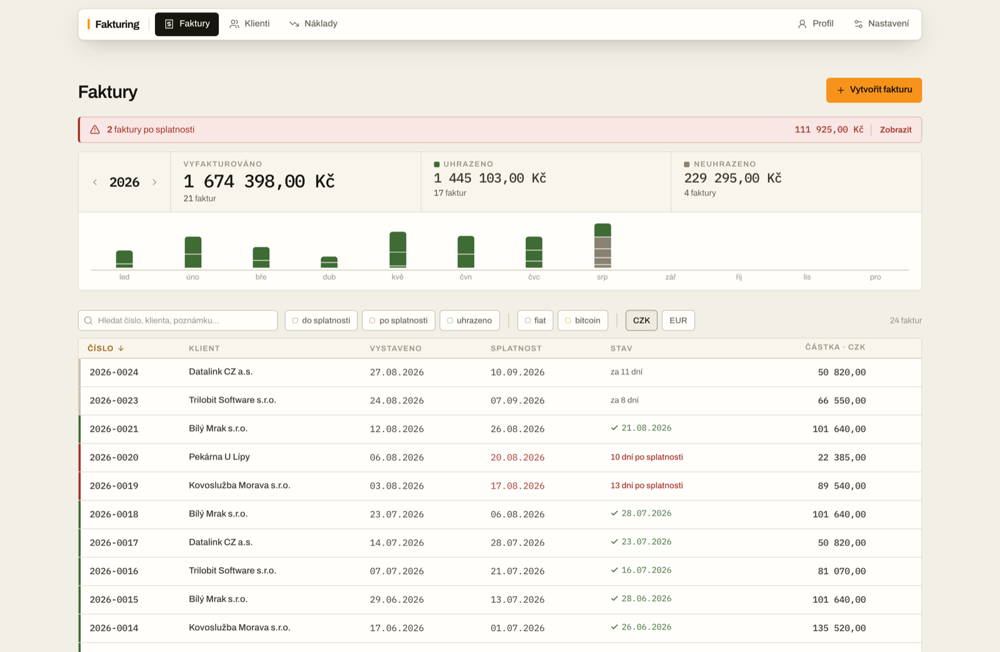

# Fakturing

A local-first invoicing app for Czech freelancers and small companies. Your data
lives in the browser, is encrypted end-to-end by Evolu, and syncs between your
devices through a relay you can point anywhere — including one you run yourself.
There is no account, no server-side database, and nothing to sign up for: a BIP39
seed phrase *is* the identity.

Czech and English UI, light and dark themes, usable on a phone, installable as
a PWA, works offline.



---

## Screens

### Faktury — invoices

The landing screen is a ledger, not a dashboard.

- **Year strip** — a 12-month bar chart of invoiced vs. paid for the selected
  year, with tick marks showing how many invoices each month carried. Arrows step
  between years that actually have invoices.
- **Overdue banner** — appears only when something is genuinely past due, per
  invoice, and filters the ledger down to those rows in one click.
- **Ledger table** — number, client, issue date, due date, state, amount, with a
  colour rail per row. Sortable, searchable, filterable by state and payment type;
  **no filter is active by default**.
- **Currency scope** — nothing is ever converted, so every total, the year strip
  and the overdue banner are scoped to a single currency. Chips switch the scope
  when you invoice in more than one.
- **Create / detail** share one composer: the detail page renders read-only and
  becomes editable only after **Upravit**, so a stray click can never change an
  issued invoice.
- **Payments** are recorded with an explicit date — including a future one, for
  when you already know when a client pays.
- **Duplicate** opens a prefilled draft rather than silently writing a new record.
- **PDF export** (A4, `@react-pdf/renderer`) with repeating table headers, totals
  that never orphan, and a filename built from your own template.
- **Czech SPD payment QR** for CZK invoices; suppressed with a note for other
  currencies, because the SPD format encodes CZK only.
- **Bitcoin invoices** — a BTC address per invoice, optionally read straight off a
  **Trezor** via Trezor Connect, plus a link to the mempool explorer of your choice.

### Klienti — clients

Address book with revenue attached: per-client invoice count, total invoiced and
outstanding (kept per currency, on separate lines, never summed across them), last
issue date, and the full invoice history. **IČO lookup against ARES** prefills
company details on both create and edit. Invoices reference clients by id, so
renaming a client keeps its history.

### Náklady — expenses

Visible only for VAT payers (it defaults to your VAT-payer flag and stays an
explicit toggle). Period-driven: pick a month, get the expenses and the VAT
figures for it, and export a **kontrolní hlášení** XML (`DPHKH1` 02.01, sections
B2/B3/C) ready for the tax portal.

### Profil — your company

Everything that ends up printed on an invoice: identity, address, contact,
VAT status, invoice footer, and **multiple bank accounts** — one per currency, with
a default — which the invoice composer then offers per invoice. Presented read-only
until you press **Upravit**, same as invoices.

### Nastavení — settings

Everything that changes how the app behaves, grouped:

| Section | Contains |
|---|---|
| **Vzhled a jazyk** | theme, language, discrete mode (masks every amount) |
| **Fakturace** | invoice number pattern, PDF filename pattern, per-unit billing default, PO requirement, expenses toggle |
| **Evolu** | relay URL and connection state, seed phrase backup and restore |
| **Bitcoin** | mempool explorer URL |
| **Export/Import dat (CSV)** | per-section checkboxes — settings, clients, invoices, expenses — exported together or separately; templates live in `public/` |
| **Nebezpečná zóna** | destructive resets |

---

## On a phone

The same screens, reshaped rather than shrunk. Three breakpoints, each set by
something that actually stops fitting:

| Below | What changes |
|---|---|
| **56rem** (896px) | A ledger row needs ~830px for its seven columns, so every ledger — invoices, clients, expenses, a client's history — becomes a list of cards carrying the same status rail. Sorting moves from the column headers to a chip strip. The year strip and the filing-period band stack, and the filter chips become one horizontally scrolling row. |
| **48rem** (768px) | The pill bar runs out of room for five destinations, so they move to a bottom tab bar and the top chrome goes away with them. Fields go to 16px (Safari zooms the page for anything smaller), controls grow to a 44px tap target, dialogs become bottom sheets, and the offline strip and toasts clear the tab bar. |
| **40rem** (640px) | The line-items table stops fitting its own columns and each row becomes a card, every field carrying the label the dropped header used to give it. |

Two things behave differently rather than just moving: row actions are always
visible, because hover reveals nothing on a touch screen, and the invoice
detail keeps its framed PDF but adds an **Otevřít PDF** link underneath — a
mobile browser renders that frame as at best one static page and at worst an
empty rectangle.

Safe-area insets are respected, so the tab bar clears the home indicator.

---

## Configuration worth knowing

**Invoice numbers** follow a pattern you set, with a live preview:

| Token | Meaning |
|---|---|
| `{rok}` | four-digit year |
| `{rr}` | two-digit year |
| `{mm}` | two-digit month |
| `{poradi}` / `{poradi:N}` | sequence, optionally zero-padded to `N` |

Default `{rok}-{poradi:4}` → `2026-0007`. The next sequence continues from the
highest existing number sharing the pattern's fixed prefix, so a pattern with
`{rok}` restarts each year while a bare `{poradi}` keeps climbing.

**PDF filenames** use their own tokens: `{cislo}`, `{klient}`, `{dodavatel}`,
`{rok}`, `{rrmmdd}`, `{rrrrmmdd}`. Punctuation inside a token's value is stripped
(`Jan Šetina` → `jansetina`) while the template's own separators are kept.
Default `faktura-{cislo}`.

**Currencies** offered: CZK, EUR, USD, GBP, PLN. Amounts are never converted.

**Relay** defaults to `wss://free.evoluhq.com` and is overridable in settings
(stored under `invoiceApp_relayUrl`). `npm run relay` starts a local one.

---

## Tech stack

- **React 19** + TypeScript, **Vite 7**
- **Tailwind CSS 4** over a CSS-custom-property token layer (`src/styles/tokens.css`)
- **react-router-dom 7** — real URLs, working deep links and back button
- **Evolu** (`@evolu/common`, `@evolu/react`, `@evolu/react-web`, `@evolu/web`) —
  local-first CRDT storage with encrypted WebSocket relay sync
- **`@react-pdf/renderer`** for invoice PDFs, **`qrcode`** for payment QR codes
- **`@trezor/connect-web`** for hardware-wallet BTC addresses
- **`bip39`** for the seed phrase, **`lucide-react`** for icons
- **`vite-plugin-pwa`** — offline shell with an explicit update prompt

---

## Getting started

Requires **Node 20+**.

```bash
npm install
npm run dev            # http://localhost:5173
```

Optionally run your own relay instead of the public one, and point settings at
`ws://localhost:8080`:

```bash
npm run relay          # RELAY_PORT / RELAY_DATA_FILE override the defaults
```

### Scripts

| Script | Does |
|---|---|
| `npm run dev` | Vite dev server |
| `npm run build` | `tsc -b` then a production build |
| `npm run preview` | serve the production build |
| `npm run lint` | ESLint (currently clean: 0 errors, 0 warnings) |
| `npm run relay` | local Evolu WebSocket relay on port 8080 |

---

## Project structure

```
src/
├── App.tsx                      # shell, nav, routes
├── main.tsx                     # entry: Evolu + Router + ConfirmProvider
├── evolu.ts                     # schema, relay URL, Evolu instance
├── index.css                    # component layer
├── styles/tokens.css            # the design tokens (palette, type, radii)
├── i18n/                        # cz + en strings, plural rules
├── components/
│   ├── InvoiceListPage.tsx      # ledger, year strip, overdue banner
│   ├── InvoiceCreatePage.tsx    # create — wraps the shared composer
│   ├── InvoiceDetailPage.tsx    # read-only detail + edit mode
│   ├── invoices/                # composer, items table, PDF, QR, pickers
│   ├── ClientsListPage.tsx      # clients + revenue
│   ├── ClientsPage.tsx          # create client (ARES)
│   ├── ClientDetailPage.tsx     # client detail + history
│   ├── clients/ClientForm.tsx
│   ├── ExpensesListPage.tsx     # period view + kontrolní hlášení XML
│   ├── ExpenseCreatePage.tsx, ExpenseDetailPage.tsx, expenses/
│   ├── ProfilePage.tsx          # company profile
│   ├── profile/BankAccounts.tsx # multiple accounts, one per currency
│   ├── SettingsPage.tsx         # preferences, CSV, relay, seed
│   ├── ConfirmProvider.tsx      # in-app confirm + notices (no native dialogs)
│   ├── PaymentDialog.tsx, OfflineBanner.tsx, PWAUpdatePrompt.tsx
└── lib/                         # pure logic + hooks
    ├── invoice.ts               # totals, status, dates
    ├── money.ts                 # currencies, formatting, SPD support
    ├── invoiceNumber.ts         # number patterns + next sequence
    ├── invoiceFileName.ts       # PDF filename templating
    ├── aging.ts, clientStats.ts # year series, per-client totals
    ├── bankAccounts.ts, useLegacyBankAccountMigration.ts
    ├── useInvoiceForm.ts, useAres.ts, useTrezorAddress.ts, useInvoiceQr.ts
    └── useTheme.ts, confirmContext.ts, useClientIdBackfill.ts
```

## Conventions

- **Read-only first.** Records render as documents; editing is an explicit mode.
- **No native browser UI.** No `alert`/`confirm`, no system dropdowns, no number
  spinners — every control is in the app's own design language.
- **Amounts are tabular.** Monospaced figures, aligned, and maskable via discrete
  mode for screen sharing.
- **Migrations run silently.** Legacy single bank accounts and name-joined
  invoices are upgraded on load, without asking.
- **Layout switches, it does not scale.** A table that will not fit is
  rewritten as cards rather than clipped or shrunk; the two layouts render from
  the same rows and swap in CSS.

## Known gaps

- **No invoice drafts** — an interrupted invoice is lost.

## License

MIT
